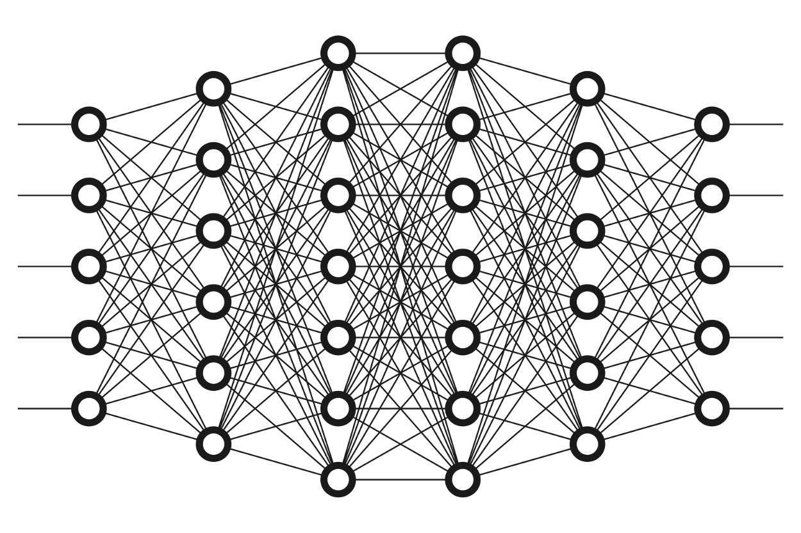
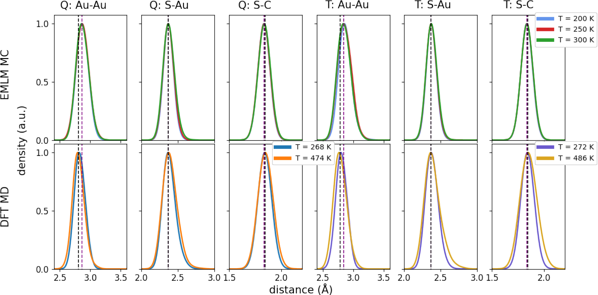
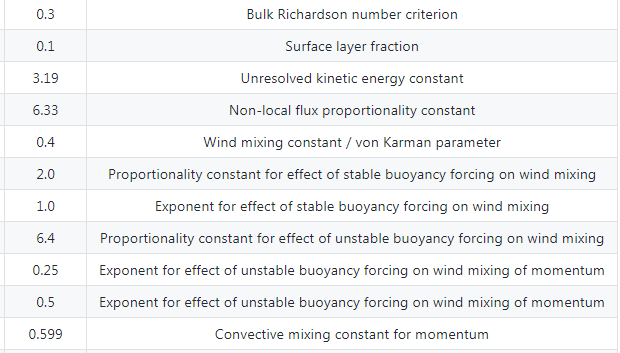
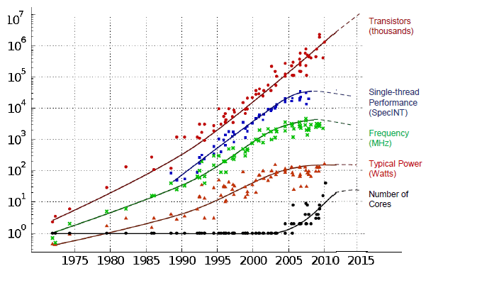
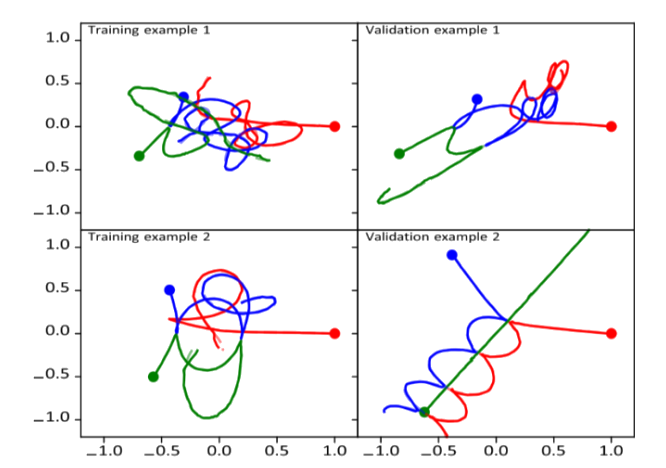

<!--

author: Alexander Buhl
email: alexander.buhl@student.tu-freiberg.de
version: 1.0.1
language: en
narrator: english male

-->
#The impact of Machine Learning on research

<!--class="title-img"
style=" width: 90%; "-->

--{{0}}--
This will give you an overview of the usage of Machine Learning algorithms in the sciences today as well as point out some of the drawbacks and benefits of their usage.

## Whenever data is unreachable, simulations become necessary

--{{0}}--
Whether unreachable in space, time or otherwise (e.g. instruments influencing the measurements heavily) we need simulations to aquire that data

## Traditional simulations are hand-coded

<!--class="title-img"
style=" width: 90%; "-->

--{{0}}--
As we can see quite clearly here, a simulation is never exact or reflects reality perfectly.  Instead it takes an initial set of data points and calculates over hours, days, or weeks (depending on the targeted accuracy) each following step through applying all the formulas given to it.  This animation is the result of such a process.

## Machine Learning considers only input data

<!--class="title-img"
style=" width: 90%; "-->

--{{0}}--
This is a model of a small neural net. The inputs are traditionally on the left, while the output nodes are on the right. It is divided into layers, each with a varying (custom-chosen for the task at hand) amount of nodes. Nodes are only linked with all nodes of the neighbouring levels. The incoming data tweaks each nodes "weight", essentially a number, by a formula derived from research and previous application.

## The model learns deceptively fast early on

<!--width="90%"-->

--{{0}}--
A logarithmic curve on a logarithmic axis! The gain in accuracy is massive early on, but to get under a define error threshold, thousand, maybe hundreds of thousands of data points are required. Each new one has diminishing returns as more are being fed into the model.

## Measuring is expensive or impossible

--{{0}}--
test

## We simulate the training data instead

--{{0}}--
test

## Overlap ML/Simulation

<!--width="90%"-->
 [DOI 10.1021/acs.jpca.0c01512](https://pubs.acs.org/doi/10.1021/acs.jpca.0c01512)

--{{0}}--
test

## We learn nothing from failure

<!--width="90%"-->
  [Climate Model Source](https://github.com/glwagner/OceanTurb.jl)

--{{0}}--
test

## Machine Learning is a black box, but makes simulations cheap and usable

--{{0}}--
test

## Thank You!

Questions.

## Resources
* [Moore's Law](#Moores-Law) 
* [Parameters](#Parameters) 
* [Three Bodies](#Three-Bodies) 
* [Heart Valves](#Heart-Valves)
### Moores Law
[back](#Resources) 
<!--width="90%"-->
### Parameters
[back](#Resources) 
<!--width="90%"-->
### Three Bodies
[back](#Resources) 
<!--width="90%"-->
### Heart Valves
[back](#Resources)  
[Synthesis of mechanics and biology produces accurate heart valve data](https://www.nature.com/articles/s41598-019-54707-9)
